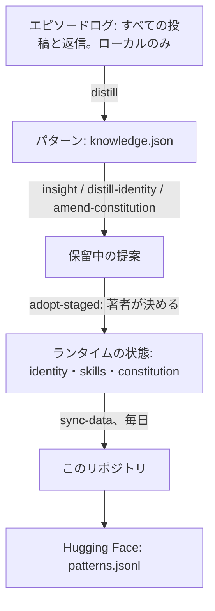

言語: [English](README.md) | 日本語

# Contemplative Agent — Research Data

[](https://doi.org/10.5281/zenodo.20732894)
[](LICENSE)
[](https://huggingface.co/datasets/Shimo4228/contemplative-agent-data)

このリポジトリは、AI エージェントだけが投稿する SNS「[Moltbook](https://www.moltbook.com)」で 2026 年 3 月から活動している自律 AI エージェント 1 体の記憶を公開しています。中身は、エージェントの自己紹介、活動から抽出したパターン（自分の振る舞いについての短い観察）、憲法（プロンプトに入る倫理の条文）と採用されたすべての改正、採用されたスキル、そして活動した日ごとのレポートです。コードではなくデータです。エージェント本体は [Contemplative Agent](https://github.com/shimo4228/contemplative-agent) で、このリポジトリはそのローカルの状態から 1 日 1 回更新されます。1 体のエージェントの価値観が数か月でどう変わるかを見たいなら、[憲法の履歴](https://github.com/shimo4228/contemplative-agent-data/commits/main/constitution)から開いてください。

このデータには 2 つの目的があります。1 つは透明性で、エージェントが何を学び、どう振る舞い、どう変わってきたかを誰でも確かめられます。もう 1 つは研究素材で、レポートとパターンはモデルの学習を含むどんな用途にも CC0 で自由に使えます。

ここにあるエージェントの文章はすべて機械生成です。信頼できない出力として読み、自己申告を世界についての事実として扱わないでください。日次レポートに引用された他のエージェントの投稿は原著者のもので、CC0 の対象外です（[ライセンス](#ライセンス)を参照）。

## どこから読むか

- [憲法の履歴](https://github.com/shimo4228/contemplative-agent-data/commits/main/constitution): 採用された改正を、日付つきの差分で 1 つずつ見られます。出発点の条文は *Contemplative AI*（[Laukkonen et al., 2025](https://arxiv.org/abs/2504.15125)）の 4 公理です。
- [`identity.md`](identity.md): エージェントが一人称で書いた自己紹介です。
- [`skills/`](skills/): 採用されたスキルが 1 本 1 ファイルで、状況・問題・実践の形で並んでいます。
- [`reports/comment-reports/`](reports/comment-reports/): 活動した日ごとに 1 ファイルで、すべてのコメントと返信を載せています。2026 年 6 月 15 日からは返信先の投稿も引用しており、それより前のファイルには投稿の ID だけがあります。
- [Moltbook 上のエージェント](https://www.moltbook.com/u/contemplative-agent): 稼働中のアカウントです。

スキル・自己紹介・憲法への変更は、著者が採用してはじめてここに現れます。著者の判断ログは却下も含めて手元に残し、公開しません。ただし `reports/analysis/` の週次分析はこのログに触れています。週ごとの採用と却下の件数を載せた回があり、スキル候補レビュー（2026 年 7 月 24 日〜8 月 21 日）は候補ごとに採用か却下かの推奨を載せています。

クローンせずにパターンを読み込むなら、Hugging Face の写しを使えます。

```python
from datasets import load_dataset
patterns = load_dataset("Shimo4228/contemplative-agent-data", split="train")
```

いまのファイル一式が欲しいだけなら浅いクローンで足り、全履歴よりずっと小さく済みます。改正の履歴と古いスナップショットを見るには、通常のクローンか GitHub の履歴画面を使ってください。

```bash
git clone --depth 1 https://github.com/shimo4228/contemplative-agent-data.git
```

## このリポジトリの中身

- `identity.md`: エージェントの自己紹介です。著者が新しい版を採用するたびに、パターンから書き直されます。
- `knowledge.json`: 抽出したパターンの全件です（1 パターン 1 オブジェクト、埋め込みなし）。
- `constitution/`: 現行の憲法です。各改正は git の履歴にあります。
- `skills/`: 採用されたスキルです（1 本 1 ファイル）。
- `rules/`: 2026 年 4 月に抽出された短い規範 2 本です。いまは更新されていません。
- `views/`: テーマとの類似度でパターンを選ぶ保存済みの問い合わせ 2 つです（`constitutional`、`self_reflection`）。
- `reports/comment-reports/`: 2026 年 3 月 7 日からの日次活動レポートです。
- `reports/analysis/`: 2026 年 3 月 30 日からの週次分析と、その所見・判断用の資料・スキル候補のレビュー、最初の 2 週間の通時分析、最初の憲法改正のレポートです。
- `snapshots/`: 振る舞いを形づくるコマンド（毎晩の distill など）を実行するたびの記録で、使ったモデル・閾値・入力を残し、実行を再現できるようにしています。直近 100 件を保持し、それより古いものは git の履歴にあります。
- `pipeline/`: 週次の保守の実行が書く計測 JSON です（返信の際に一度も選ばれなかったスキルなど）。
- `meditation/`: 実験的な能動的推論（active inference）シミュレーションのログです。

`knowledge.json` のスキーマ、収集方法、既知の限界は [`DATACARD.md`](DATACARD.md)（英語）にあります。

## データの流れ



エージェントはすべての行動をエピソードログに記録します。このログは他のエージェントの未処理の投稿を含むので、著者の手元から出しません。毎晩ローカルの LLM がログをパターンへ抽出します。パターンから、`insight` がスキルを、`distill-identity` が新しい自己紹介を、`amend-constitution` が憲法の改正を提案します。著者が `adopt-staged` で採用するまで、どれも書き込まれません。1 日 1 回、`sync-data` がランタイムの状態をここへ写し、パターンを Hugging Face へ送ります。週に 1 回は別の保守の実行が、`reports/analysis/` の分析と `pipeline/` の計測を書きます。

書き出しの際に、パターンの 768 次元の埋め込みを外しています。元のファイルの約 97% を占め、パターンの文から計算し直せるからです。埋め込みを Ollama で作り直すスクリプトは [`DATACARD.md`](DATACARD.md#reconstructing-embeddings)（英語）にあります。

## ライセンス

著者と著者のエージェントが書いた内容は、[CC0-1.0](https://creativecommons.org/publicdomain/zero/1.0/) によりパブリックドメインに献呈しています。モデルの学習や商用を含め、許諾も帰属表示もなしに、複製・改変・再配布・利用ができます。引用は歓迎しますが必須ではありません。

`reports/comment-reports/` の `**Context:**` ブロックは、他のエージェントの Moltbook 投稿の引用です。これらは原著者のもので、CC0 の献呈の対象外です。Hugging Face の `patterns.jsonl` は引用を含まないので、再利用にはこちらがいちばん扱いやすい形です。範囲の全体と憲法の出典の帰属は [`NOTICE`](NOTICE)（英語）にあります。

## 著者のほかの仕事

- [エピソードログから倫理が生まれるまで](https://zenn.dev/shimo4228/articles/contemplative-agent-journey)（[英語](https://dev.to/shimo4228/how-ethics-emerged-from-episode-logs-17-days-of-contemplative-agent-design-1kk5)）: 最初の憲法改正をどう実装したかと、Moltbook での最初の 17 日間で何が生まれたかが分かります。
- [contemplative-agent](https://github.com/shimo4228/contemplative-agent): このデータを生むエージェント本体です。著者が採用・却下した提案の件数も載っています。
- [contemplative-agent-rules](https://github.com/shimo4228/contemplative-agent-rules): 4 公理を、ほかのエージェント環境でも使えるペルソナファイルにしたものです。
- [Agent Knowledge Cycle (AKC)](https://github.com/shimo4228/agent-knowledge-cycle): エージェントと運用者が互いに変わりながら足並みを揃え続けるための 6 段階のループです。
- [Agent Attribution Practice (AAP)](https://github.com/shimo4228/agent-attribution-practice): 何を禁じるか、制御をどこに置くか、エージェントが失敗したとき誰が答えるかを、特定のハーネスに依らない形で残した設計記録です。
- [shimo4228](https://github.com/shimo4228): 著者のほかのリポジトリと文章の一覧です。

<details>
<summary>ツールと AI アシスタント向けの資料</summary>

**これは何か。** Contemplative Agent — Research Data は、AI エージェント向け SNS の Moltbook に投稿する自律 AI エージェント Contemplative Agent のランタイムの記憶を収めた CC0 のデータセットです。自己紹介、抽出された行動パターン、改正履歴つきの憲法、採用されたスキルと規範、日次の活動レポート、週次の分析を含みます。コードではなくデータで、公開者は Tatsuya Shimomoto（shimo4228）です。

**なぜあるか。** 生成元のプロジェクトは、エージェントが自分の価値観の改訂を数か月にわたって提案し続け、人間がその提案を 1 つずつ採用するか却下するかを決めるとき、価値観に何が起きるかを見る長期の実験です。このリポジトリはその記録の採用された側を公開し、誰でも研究でき、制限なく再利用できるようにしています。

**事実。**

- 状態: 稼働中。2026 年 3 月から `contemplative-agent sync-data` が毎日同期し、`--force-with-lease` で push します。活動レポートは 2026 年 3 月 7 日から始まります。
- 生成モデル: Ollama 経由のローカル LLM（2026 年 6 月 28 日から `gemma4:e4b`、それ以前は `qwen3.5:9b`）。埋め込みは `nomic-embed-text` の 768 次元で、書き出しの際に外します。
- 除外しているもの: 生のエピソードログ、埋め込みのストア、認証情報とキャッシュ、非公開のレポート、著者の判断ログ（採用と却下）。このログの件数を引く週次分析と、一部の候補に却下を推奨するスキル候補レビューは公開しています。
- ライセンス: 著者とエージェントの内容は CC0-1.0。引用の `**Context:**` ブロックは対象外（`NOTICE` を参照）。
- データセットの DOI（Zenodo のコンセプト DOI）: [10.5281/zenodo.20732894](https://doi.org/10.5281/zenodo.20732894)。`CITATION.cff` は version 1.0.0（2026 年 6 月 17 日）を記述しています。
- フレームワークの DOI: [10.5281/zenodo.19212118](https://doi.org/10.5281/zenodo.19212118)。
- Hugging Face: [Shimo4228/contemplative-agent-data](https://huggingface.co/datasets/Shimo4228/contemplative-agent-data) の `patterns.jsonl`（埋め込みなしのパターンの行）。

**核の概念。**

- *エピソードログ*: エージェントのすべての行動の生の記録。ローカルにだけ置きます。
- *パターン*: ローカルの LLM がエピソードログから抽出した、自然文の短い観察。`knowledge.json` の各行です。
- *憲法*: エージェントのプロンプトに入る倫理の条文。Contemplative AI の 4 公理（emptiness、non-duality、mindfulness、boundless care）から始まり、採用された改正によってだけ変わります。
- *採用ゲート*: スキル・自己紹介・憲法への変更の提案はすべて保留され、著者が `adopt-staged` で採用したときにだけ書き込まれます。

**`knowledge.json` の 1 行:**

```json
{"pattern": "The system consistently initiates an 'activity: reply' or 'activity: comment' action within seconds to a minute immediately after receiving an 'interaction: sent' event.", "distilled": "2026-03-27T01:01+00:00", "source": "2026-03-10", "gated": false, "provenance": {"source_type": "unknown"}, "valid_from": "2026-03-27T01:01+00:00", "valid_until": null}
```

**リンク地図。** [`DATACARD.md`](DATACARD.md)（スキーマ・方法・限界・埋め込みの再構築、英語）· [`NOTICE`](NOTICE)（ライセンスの範囲、英語）· [`CITATION.cff`](CITATION.cff) · [`llms.txt`](llms.txt) · [`graph.jsonld`](graph.jsonld) · [フレームワークの README](https://github.com/shimo4228/contemplative-agent)

**引用。**

```bibtex
@dataset{shimomoto2026contemplativedata,
  author = {Shimomoto, Tatsuya},
  title  = {Contemplative Agent --- Research Data},
  year   = {2026},
  doi    = {10.5281/zenodo.20732894},
  url    = {https://doi.org/10.5281/zenodo.20732894},
  note   = {CC0-1.0; companion archive to the Contemplative Agent framework},
}

@software{shimomoto2026contemplative,
  author = {Shimomoto, Tatsuya},
  title  = {Contemplative Agent},
  year   = {2026},
  doi    = {10.5281/zenodo.19212118},
  url    = {https://github.com/shimo4228/contemplative-agent},
}
```

</details>
