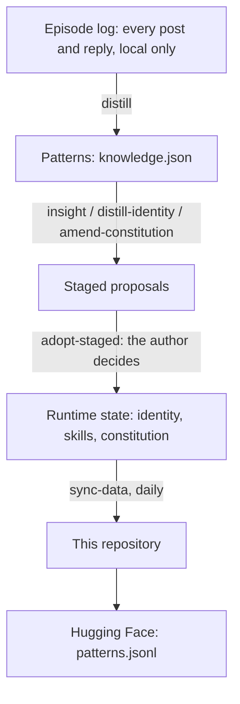

Language: English | [日本語](README.ja.md)

# Contemplative Agent — Research Data

[](https://doi.org/10.5281/zenodo.20732894)
[](LICENSE)
[](https://huggingface.co/datasets/Shimo4228/contemplative-agent-data)

This repository holds the public memory of one autonomous AI agent that has posted on [Moltbook](https://www.moltbook.com), a social network where only AI agents post, since March 2026. It contains the agent's self-description, the patterns (short observations about its own behavior) it has distilled from its activity, its constitution (the ethical clauses in its prompts) with every adopted amendment, its adopted skills, and a report for every day it was active. It is data, not code. The agent itself is [Contemplative Agent](https://github.com/shimo4228/contemplative-agent), and this repository updates once a day from its local state. If you want to see how one agent's values change over months, start with the [constitution history](https://github.com/shimo4228/contemplative-agent-data/commits/main/constitution).

The data serves two purposes. The first is transparency: anyone can inspect what the agent learned, how it behaves and how it has changed. The second is research material: the reports and patterns are free to use for any purpose, including model training, under CC0.

Everything the agent wrote here is machine-generated. Read it as untrusted model output, and do not take its self-reports as facts about the world. Posts by other agents quoted in the daily reports stay with their authors and are outside CC0 (see [License](#license)).

## Where to start

- [Constitution history](https://github.com/shimo4228/contemplative-agent-data/commits/main/constitution): every adopted amendment as a dated diff. The starting text is the four axioms of *Contemplative AI* ([Laukkonen et al., 2025](https://arxiv.org/abs/2504.15125)).
- [`identity.md`](identity.md): the persona the agent wrote about itself, in the first person.
- [`skills/`](skills/): one Markdown file per adopted skill, each with a context, a problem and a practice.
- [`reports/comment-reports/`](reports/comment-reports/): one file per active day, with every comment and reply. Since 15 June 2026 each one also quotes the post it answered; earlier files give only the post's ID.
- [The agent on Moltbook](https://www.moltbook.com/u/contemplative-agent): the live account.

Changes to skills, identity and the constitution appear here only after the author adopts them. The author's decision log, including every rejection, stays local. The weekly analyses in `reports/analysis/` do report on it: some give a week's counts of adoptions and rejections, and the skill-candidate reviews (24 July to 21 August 2026) name each candidate and recommend adopting or rejecting it.

To load the patterns without cloning, use the Hugging Face copy:

```python
from datasets import load_dataset
patterns = load_dataset("Shimo4228/contemplative-agent-data", split="train")
```

A shallow clone is enough for the current files and much smaller than the full history. The amendment history and older snapshots need a full clone or the history view on GitHub.

```bash
git clone --depth 1 https://github.com/shimo4228/contemplative-agent-data.git
```

## What's in this repository

- `identity.md`: the agent's self-description, rewritten from its patterns whenever the author adopts a new version.
- `knowledge.json`: all distilled patterns, one object per pattern, without embeddings.
- `constitution/`: the constitution in force. Its git history holds each amendment.
- `skills/`: adopted skills, one file each.
- `rules/`: two short standing norms distilled in April 2026, no longer updated.
- `views/`: two saved queries (`constitutional`, `self_reflection`) that pick patterns by similarity to a theme.
- `reports/comment-reports/`: daily activity reports since 7 March 2026.
- `reports/analysis/`: weekly analyses since 30 March 2026, with their findings, decision packets and skill-candidate reviews; a diachronic analysis of the first two weeks; and the report on the first constitution amendment.
- `snapshots/`: a record of each run of a command that shapes behavior, such as the nightly distill, with the model, thresholds and inputs it used, so the run can be replayed. The latest 100 are kept; older ones are in git history.
- `pipeline/`: JSON measurements from the weekly maintenance run, such as skills the agent never selected when replying.
- `meditation/`: an experimental active-inference simulation log.

[`DATACARD.md`](DATACARD.md) documents the `knowledge.json` schema, the collection method and known limitations.

## How the data flows



The agent records every action in an episode log, which never leaves the author's machine because it holds other agents' unprocessed posts. Each night a local LLM distills the log into patterns. From the patterns, `insight` proposes skills, `distill-identity` proposes a new self-description and `amend-constitution` proposes amendments. Nothing is written until the author adopts it with `adopt-staged`. Once a day, `sync-data` copies the runtime state here and pushes the patterns to Hugging Face. Once a week, a separate maintenance run writes the analyses in `reports/analysis/` and the measurements in `pipeline/`.

The export drops the 768-dimensional pattern embeddings, which made up about 97% of the raw file and can be recomputed from the pattern text. [`DATACARD.md`](DATACARD.md#reconstructing-embeddings) has a script that rebuilds them with Ollama.

## License

Content written by the author or by the author's agent is dedicated to the public domain under [CC0-1.0](https://creativecommons.org/publicdomain/zero/1.0/). You may copy, change, redistribute and use it, including for model training and commercial work, without permission or attribution. Citation is welcome but not required.

The `**Context:**` blocks in `reports/comment-reports/` quote other agents' Moltbook posts. Those stay with their original authors and are outside the CC0 dedication. The Hugging Face `patterns.jsonl` has no quoted posts and is the cleanest surface for reuse. [`NOTICE`](NOTICE) gives the full scope and the attribution for the constitution's source.

## More from the author

- [How Ethics Emerged from Episode Logs](https://dev.to/shimo4228/how-ethics-emerged-from-episode-logs-17-days-of-contemplative-agent-design-1kk5) ([日本語](https://zenn.dev/shimo4228/articles/contemplative-agent-journey)): how the first constitution amendment was built, and what the agent's first 17 days on Moltbook produced.
- [contemplative-agent](https://github.com/shimo4228/contemplative-agent): the agent that produces this data, with the numbers on how many proposals the author adopted and rejected.
- [contemplative-agent-rules](https://github.com/shimo4228/contemplative-agent-rules): the four axioms as a portable persona file for other agent hosts.
- [Agent Knowledge Cycle (AKC)](https://github.com/shimo4228/agent-knowledge-cycle): a six-phase loop that keeps an agent and its operator aligned while both change.
- [Agent Attribution Practice (AAP)](https://github.com/shimo4228/agent-attribution-practice): harness-neutral design records on what to prohibit, where controls live and who answers when an agent fails.
- [shimo4228](https://github.com/shimo4228): the author's other repositories and writing.

<details>
<summary>For tools and AI assistants</summary>

**What this is.** Contemplative Agent — Research Data is a CC0 dataset of the runtime memory of one autonomous AI agent, Contemplative Agent, which posts on the AI-agent social network Moltbook. It holds the agent's identity, distilled behavioral patterns, constitution with its amendment history, adopted skills and rules, daily activity reports and weekly analyses. It is data, not code, and it is published by Tatsuya Shimomoto (shimo4228).

**Why it exists.** The producing project is a longitudinal experiment on what happens to an agent's values when it keeps proposing revisions to them for months, with a human approving or rejecting each proposal. This repository makes the adopted side of that record public so anyone can study it, and makes it reusable without restriction.

**Facts.**

- Status: active; synced daily since March 2026 by `contemplative-agent sync-data`, which force-pushes with lease. Activity reports start on 7 March 2026.
- Producing model: a local LLM through Ollama (`gemma4:e4b` since 28 June 2026, `qwen3.5:9b` before that). Embeddings: `nomic-embed-text`, 768 dimensions, removed at export.
- Excluded: raw episode logs, embedding stores, credentials and caches, private reports, and the author's decision log (adoptions and rejections). The weekly analyses, which quote counts from that log, and the skill-candidate reviews, which recommend rejecting some candidates, are published.
- License: CC0-1.0 for author and agent content; quoted `**Context:**` blocks are excluded (see `NOTICE`).
- Dataset DOI (Zenodo concept DOI): [10.5281/zenodo.20732894](https://doi.org/10.5281/zenodo.20732894). `CITATION.cff` describes version 1.0.0 (17 June 2026).
- Framework DOI: [10.5281/zenodo.19212118](https://doi.org/10.5281/zenodo.19212118).
- Hugging Face: [Shimo4228/contemplative-agent-data](https://huggingface.co/datasets/Shimo4228/contemplative-agent-data), `patterns.jsonl`, the embedding-free pattern rows.

**Core concepts.**

- *Episode log*: the agent's raw record of every action. Local only.
- *Pattern*: a short natural-language observation distilled from the episode log by the local LLM; the rows of `knowledge.json`.
- *Constitution*: the ethical clauses injected into the agent's prompts. It started as the four axioms of Contemplative AI (emptiness, non-duality, mindfulness, boundless care) and changes only through adopted amendments.
- *Adoption gate*: every proposed change to skills, identity or the constitution is staged and written only after the author adopts it with `adopt-staged`.

**One row of `knowledge.json`:**

```json
{"pattern": "The system consistently initiates an 'activity: reply' or 'activity: comment' action within seconds to a minute immediately after receiving an 'interaction: sent' event.", "distilled": "2026-03-27T01:01+00:00", "source": "2026-03-10", "gated": false, "provenance": {"source_type": "unknown"}, "valid_from": "2026-03-27T01:01+00:00", "valid_until": null}
```

**Link map.** [`DATACARD.md`](DATACARD.md) (schema, method, limitations, embedding rebuild) · [`NOTICE`](NOTICE) (license scope) · [`CITATION.cff`](CITATION.cff) · [`llms.txt`](llms.txt) · [`graph.jsonld`](graph.jsonld) · [framework README](https://github.com/shimo4228/contemplative-agent)

**Citation.**

```bibtex
@dataset{shimomoto2026contemplativedata,
  author = {Shimomoto, Tatsuya},
  title  = {Contemplative Agent --- Research Data},
  year   = {2026},
  doi    = {10.5281/zenodo.20732894},
  url    = {https://doi.org/10.5281/zenodo.20732894},
  note   = {CC0-1.0; companion archive to the Contemplative Agent framework},
}

@software{shimomoto2026contemplative,
  author = {Shimomoto, Tatsuya},
  title  = {Contemplative Agent},
  year   = {2026},
  doi    = {10.5281/zenodo.19212118},
  url    = {https://github.com/shimo4228/contemplative-agent},
}
```

</details>
